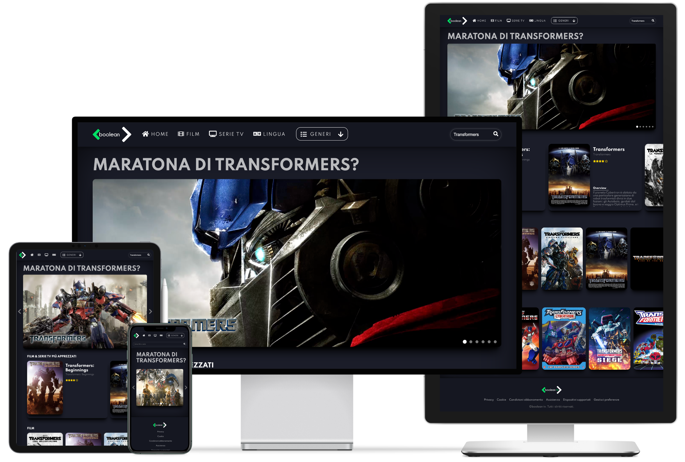

 

<h2 align="center">BoolFlix</h2>

---

BoolFlix gives you possibility to search films and movies using APIs from TMDB.

  
    
## ⛏️ Built With 

- [HTML](https://html.com) - Page Structure
- [CSS](https://www.w3.org/TR/CSS/) - Page Style
- [JavaScript](https://www.javascript.com/) - Logic
- [VueJS](https://vuejs.org) - Framework

## 🗃 External Services 

- [TMDB](https://www.themoviedb.org) - Movie and TV APIs

## ✍️ Authors 

- [@IvanDF](https://github.com/IvanDF) - Design & Develop

See also my [website!](https://ivandf.dev)
New one is in progress.
